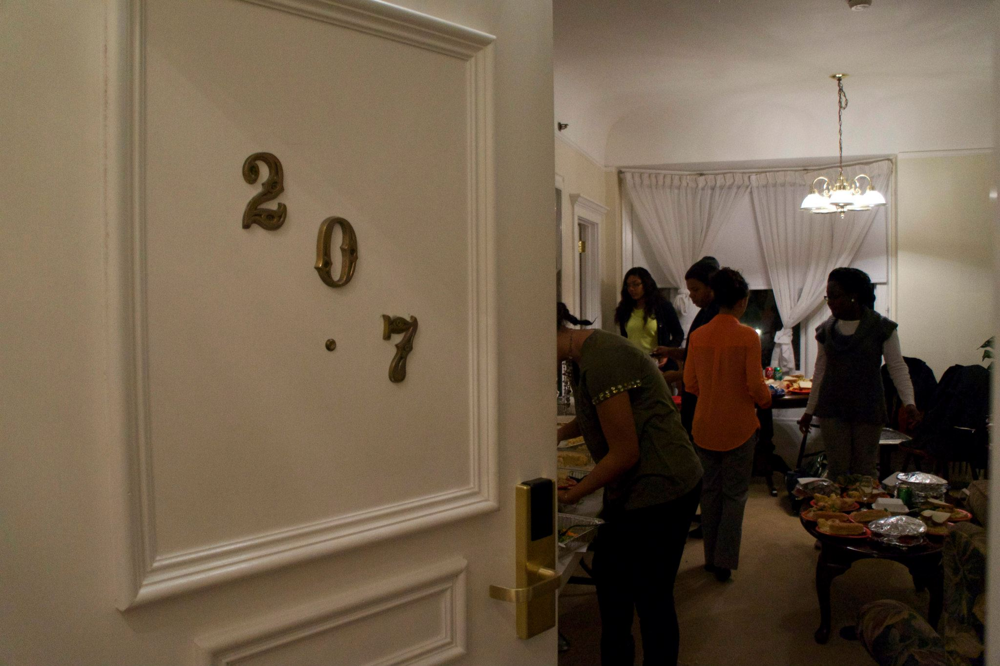

# Writing Conference and Symposium Abstracts

Under Construction

__Tasks to Complete Before July 23__
1. Draft abstract of research project

__Conferences and Financial Support__

1. Association for Sciences in Limnology and Oceanography: Multicultural Program - https://www.aslo.org/opportunities-in-aslo/aslo-multicultural-program/    

2. Geological Society of America: On to the Future - https://www.geosociety.org/GSA/Education_Careers/Grants_Scholarships/otf/GSA/OTF/Home.aspx?hkey=fa9ebe61-8ec4-4ab3-971a-7a31cd1626dc

3. American Geophysical Union: Travel Grants - https://education.agu.org/grants/student-travel-grants-application-requirements/

4. American Geophysical Union: MSPHDs http://msphdsinstitute.org/

5. Coastal, Estuarine, Research Federation: https://www.cerf.science/risingtides 

