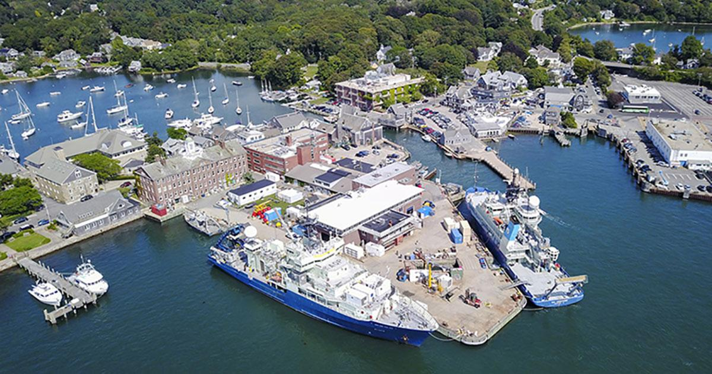

--- 
title: "PEP Class 2020"
author: "Ben Harden"
date: "`r Sys.Date()`"
site: bookdown::bookdown_site
documentclass: book
bibliography: [book.bib, packages.bib]
biblio-style: apalike
link-citations: yes
description: "This is a minimal example of using the bookdown package to write a book. The output format for this example is bookdown::gitbook."
---

# Welcome {-}

Welcome to the PEP Class 2020. The goal of this class is to prepare students to address questions pertinent to Global Climate Change within the Ocean and Environmental Sciences. The course will run over four weeks from June XX to June YY and complements a research internship with a scientist from the Woods Hole Science community by building a foundation of concepts and skills required to be a successful researcher.

